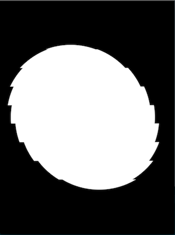
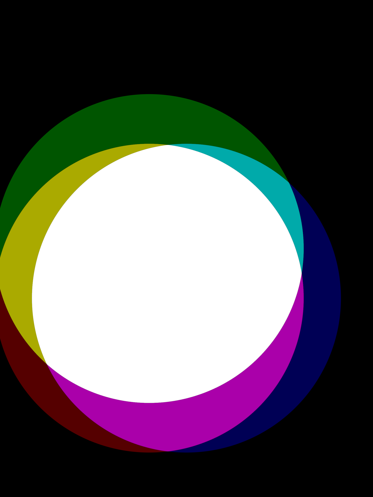
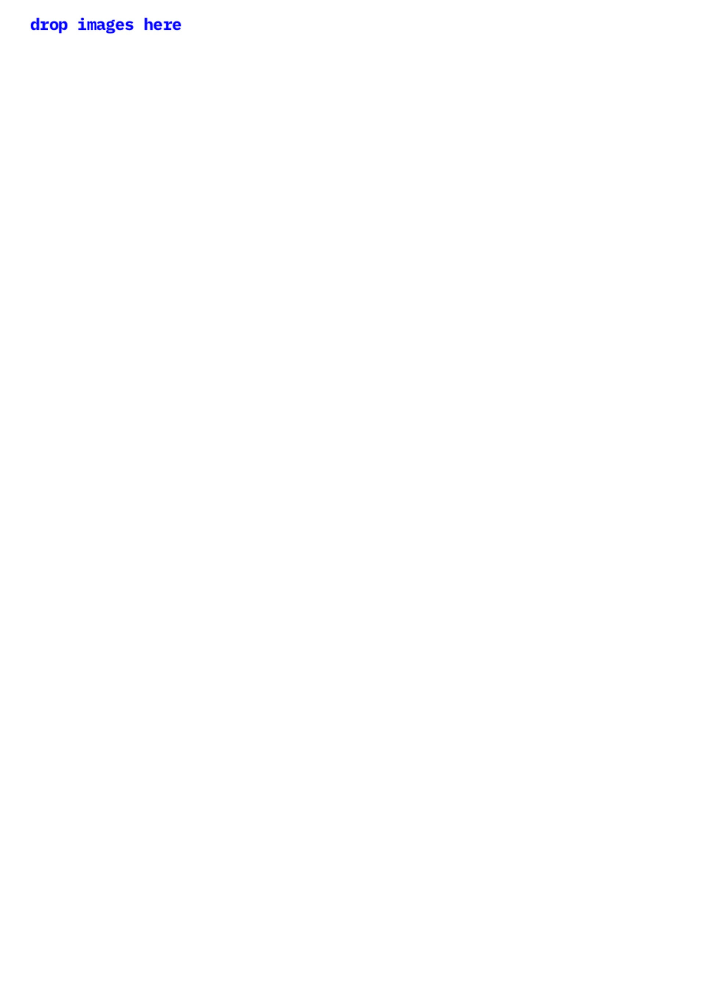
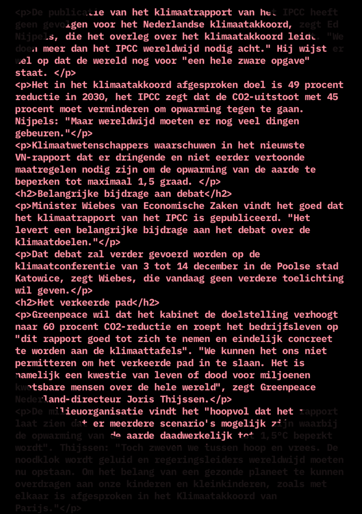
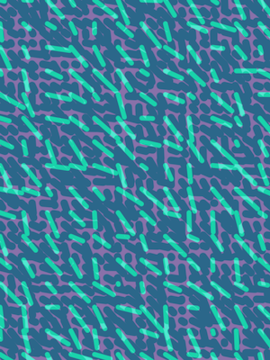
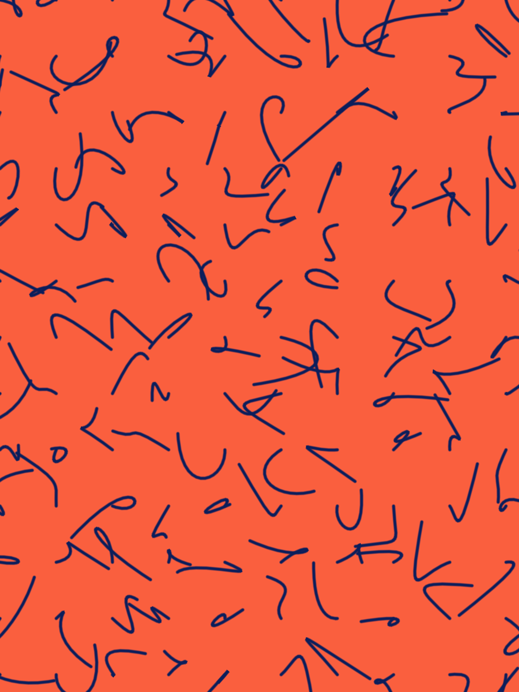
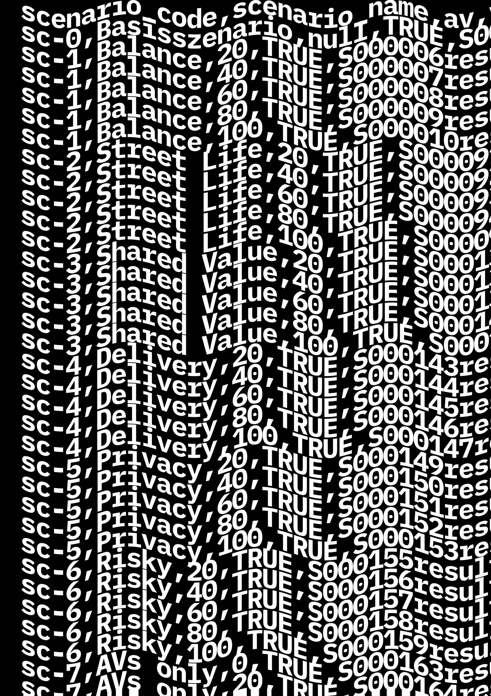
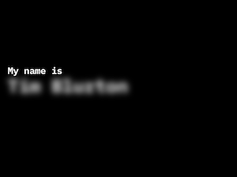
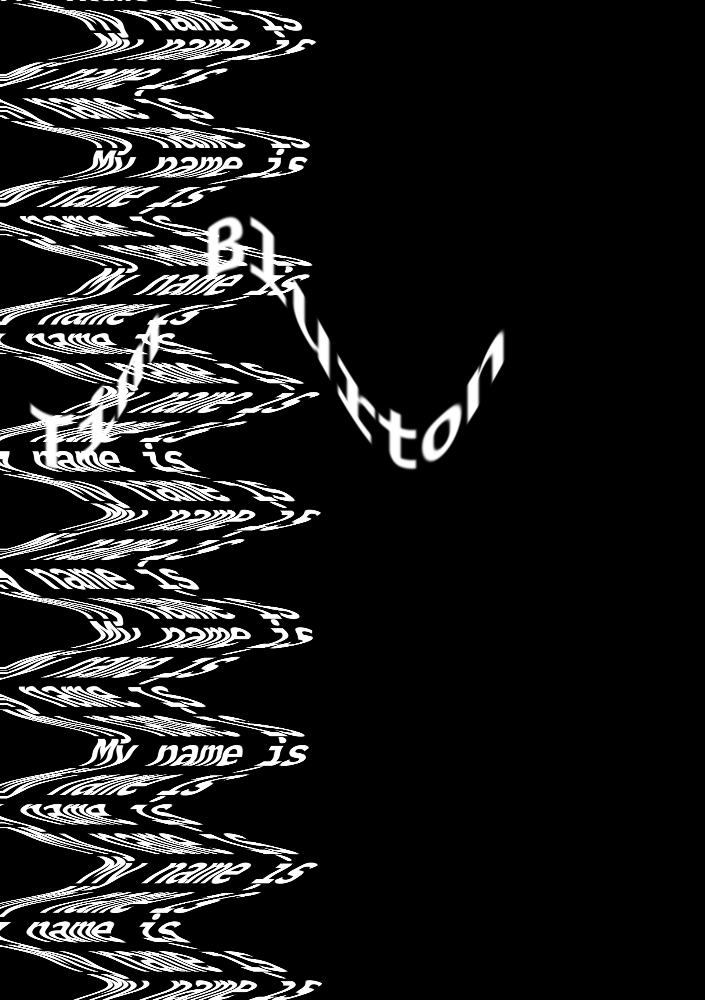
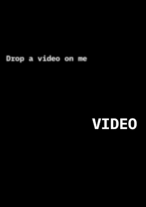

[find the examples here](https://github.com/openrndr/workshop-generative-posters/tree/master/examples/src/main/kotlin)

## Screenshots

#### effects-001

#### effects-002

#### effects-003

#### images-001

#### rss-001
Downloads text from an rss feed and makes a composition out of it. 

#### shapes-001

#### shapes-002

#### shapes-003

#### textfile-001
Loads text from a textfile and makes applies and effect to it. 

#### typography-001

#### typography-002

#### video-001
Demonstrates how to play video with OpenRNDR 

#### website-001
Downloads images and text from a website and makes a composition out of it. 

